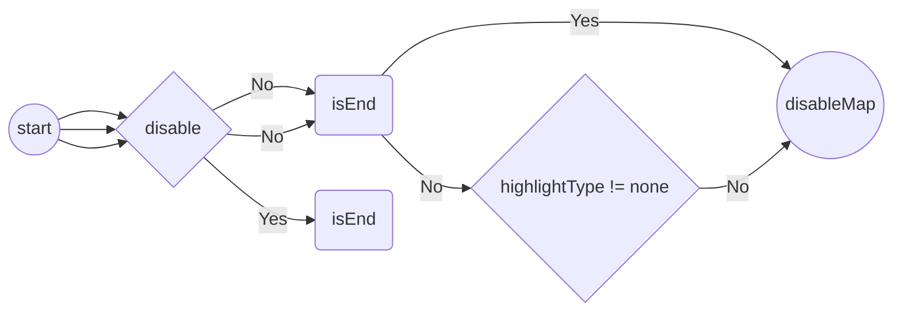

```mermaid
flowchart LR
  start((start))-->disable{disable}-- No -->isEnd(isEnd)-- Yes -->disableMap((disableMap))
	start((start))-->disable{disable}-- No -->isEnd(isEnd)-- No --> notHighlight{highlightType != none}-- No --> disableMap((disableMap))

	start((start))-->disable{disable}-- Yes -->isEnd2(isEnd)


```