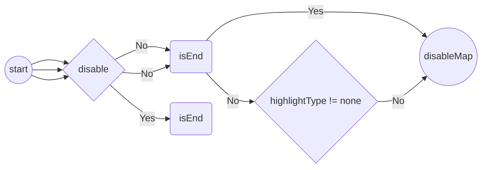

- Official doc: https://mermaid.js.org/intro/
- Support some kinds of chart
  - Flowchart
  - Sequence diagram
  - Gantt diagram
  - Class diagram
  - Git graph
  - Entity Relationship Diagram - ❗ experimental
  - User Journey Diagram
  - Quadrant Chart
  - XY Chart

